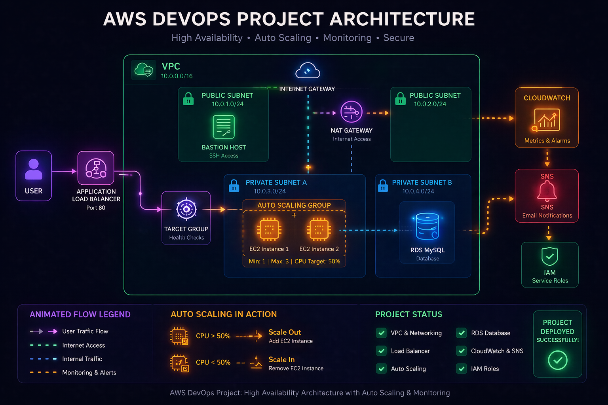
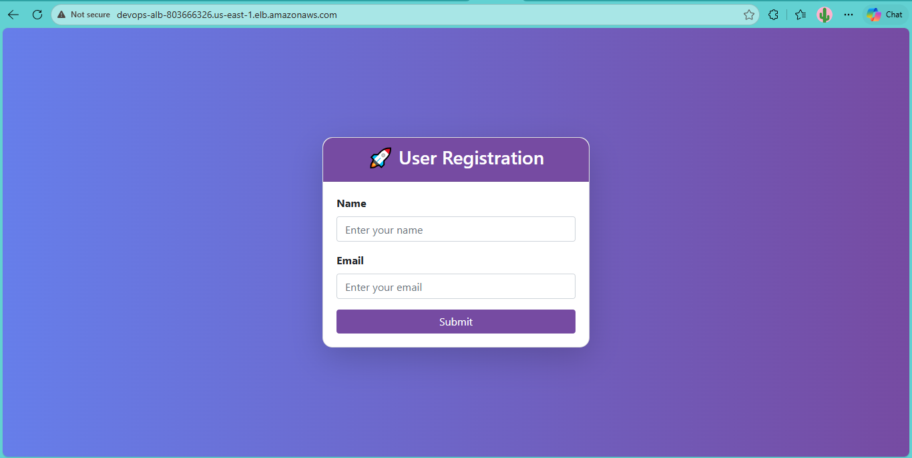
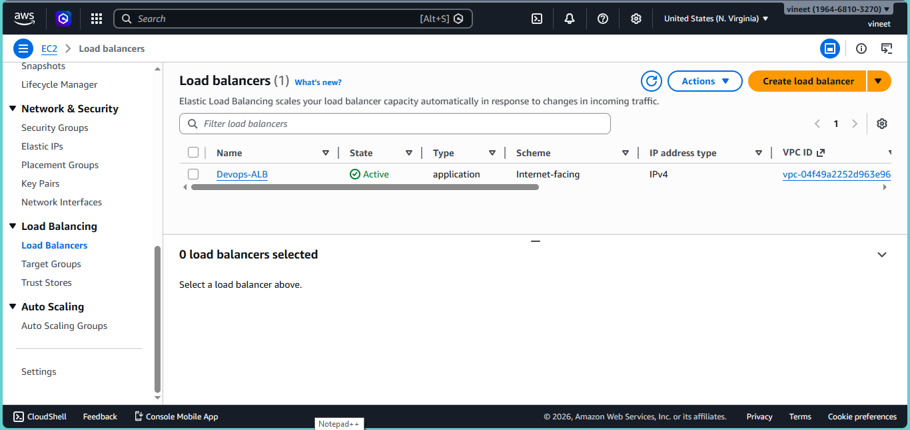
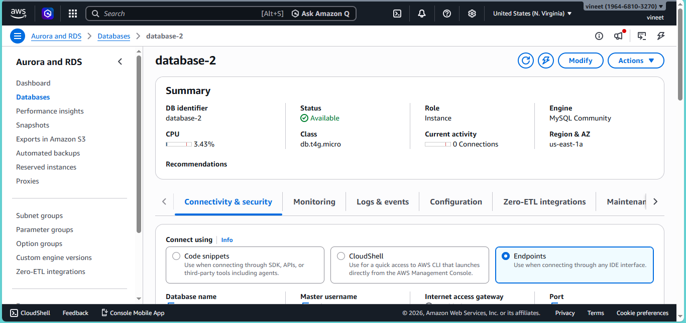
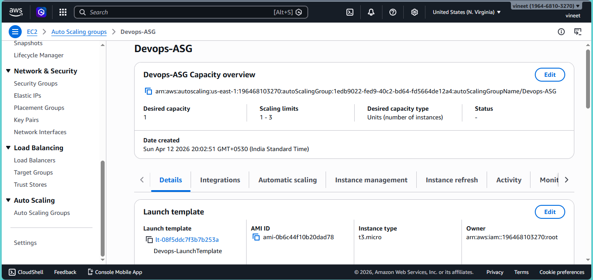
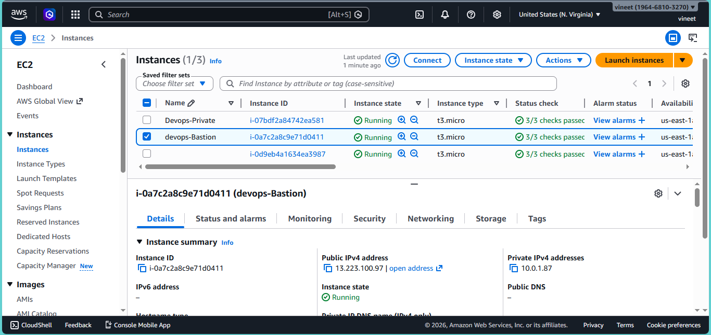

# 🚀 AWS DevOps Project

## 📌 Overview

This project demonstrates a highly available, scalable, and secure AWS architecture using real-world DevOps practices. It includes a dynamic PHP web application connected to an AWS RDS MySQL database and deployed using a production-style infrastructure.

---

## 🏗️ Architecture

---

## 🔥 Features

* Application Load Balancer (ALB)
* Auto Scaling Group (ASG)
* Private EC2 instances (secured)
* Bastion Host for secure SSH access
* RDS MySQL database
* NAT Gateway for internet access
* CloudWatch monitoring
* SNS alerts (email notifications)
* Dynamic PHP web application (user form + database storage)

---

## 🌐 Architecture Flow

User → ALB → Target Group → EC2 (Auto Scaling) → RDS

---

## 🛠️ Technologies Used

* AWS (EC2, VPC, RDS, ALB, ASG, CloudWatch, SNS, IAM)
* Linux (Ubuntu)
* Apache Web Server
* PHP
* MySQL

---

## 📸 Screenshots

### 🔹 Application via ALB (Live Output)

---

### 🔹 Application Load Balancer Configuration

---

### 🔹 RDS Database

---

### 🔹 Auto Scaling Group

---

### 🔹 Running EC2 Instances

---

## 💡 Key Learnings

* Designed and deployed a scalable AWS cloud architecture
* Implemented load balancing and auto scaling for high availability
* Secured infrastructure using private subnets and Bastion host
* Integrated monitoring and alerting using CloudWatch and SNS
* Built and deployed a full-stack web application on AWS

---

## 🚀 How to Run

1. Create VPC with public and private subnets
2. Launch EC2 instances (Bastion + Private)
3. Setup RDS MySQL database
4. Configure Application Load Balancer and Target Group
5. Create Auto Scaling Group
6. Deploy PHP application on EC2
7. Access application using ALB DNS

---

## 👨‍💻 Author

**Piyush Rai**
